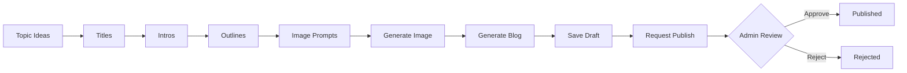

# 🚀 CMS Blog Backend

> A production-ready FastAPI backend for an AI-powered Blog Generator CMS with multi-step content creation workflow.

## ✨ Features

### 🔐 Authentication & Authorization
- **JWT-based authentication** with secure token management
- **Role-based access control** (Admin vs User)
- **Argon2 password hashing** for maximum security

### 🤖 AI-Powered Content Generation
- **5-step blog creation workflow** with exactly 5 options at each step:
  - Topic Ideas → Titles → Intros → Outlines → Image Prompts
- **Gemini AI integration** for intelligent content generation
- **AI-generated cover images** with custom prompts
- **Markdown to HTML conversion** with live preview

### 📝 Blog Management
- **Multi-stage publishing workflow**: `saved → pending → published/rejected`
- **Admin moderation panel** for content approval
- **Image upload support** (generated or device upload)
- **Dashboard statistics** for content tracking

### 🎨 Developer Experience
- **Clean REST API** with automatic documentation (Swagger/ReDoc)
- **Async MongoDB operations** using Motor
- **Modular architecture** with services and routers
- **Type-safe** with Pydantic schemas

---

## 🏗️ Architecture

```
┌─────────────────────────────────────────────────────────────┐
│                         FastAPI App                         │
├─────────────────────────────────────────────────────────────┤
│  ┌──────────┐  ┌──────────┐  ┌──────────┐  ┌──────────┐   │
│  │   Auth   │  │    AI    │  │  Blogs   │  │  Admin   │   │
│  │  Router  │  │  Router  │  │  Router  │  │  Router  │   │
│  └────┬─────┘  └────┬─────┘  └────┬─────┘  └────┬─────┘   │
├───────┼─────────────┼─────────────┼─────────────┼──────────┤
│  ┌────▼─────────────▼─────────────▼─────────────▼──────┐   │
│  │              Services Layer                          │   │
│  │  • Gemini Service  • Image Service  • Markdown      │   │
│  └──────────────────────────────────────────────────────┘   │
├─────────────────────────────────────────────────────────────┤
│  ┌──────────────────────────────────────────────────────┐   │
│  │                  MongoDB (Motor)                     │   │
│  │            • users_col  • blogs_col                  │   │
│  └──────────────────────────────────────────────────────┘   │
└─────────────────────────────────────────────────────────────┘
```

---

## 🛠️ Tech Stack

| Component | Technology |
|-----------|-----------|
| **Framework** | FastAPI |
| **Database** | MongoDB (Motor async driver) |
| **Authentication** | JWT (`python-jose`) |
| **Password Security** | Argon2 (`argon2-cffi`) |
| **AI Engine** | Google Gemini AI |
| **Markdown Parser** | `markdown` |
| **Server** | Uvicorn (ASGI) |

---

## 📋 Prerequisites

- **Python 3.10+** (Python 3.11 recommended)
- **MongoDB** (local installation or MongoDB Atlas)
- **Google Gemini API Key** ([Get one here](https://ai.google.dev/))

---

## 🚀 Quick Start

### 1️⃣ Clone the Repository

```bash
git clone <repository-url>
cd backend
```

### 2️⃣ Create Virtual Environment

**Windows (PowerShell):**
```powershell
python -m venv venv
.\venv\Scripts\Activate.ps1
```

**Linux/macOS:**
```bash
python -m venv venv
source venv/bin/activate
```

### 3️⃣ Install Dependencies

```bash
python -m pip install -U pip
pip install -r requirements.txt
```

### 4️⃣ Configure Environment

Create a `.env` file in the `backend/` directory:

```env
# Application
APP_NAME=CMS Blog API
ENV=dev

# Database
MONGODB_URI=mongodb://localhost:27017
MONGODB_DB=cms_blog

# Security
JWT_SECRET=your-super-secret-key-change-this
JWT_EXPIRES_MINUTES=10080

# Admin Account
ADMIN_EMAIL=admin@company.com

# CORS & Public URL
CORS_ORIGINS=http://localhost:5173,http://127.0.0.1:5173
PUBLIC_BASE_URL=http://127.0.0.1:8000

# Gemini AI
GEMINI_API_KEY=your_gemini_api_key_here
GEMINI_TEXT_MODEL=gemini-2.0-flash-exp
GEMINI_IMAGE_MODEL=imagen-3.0-generate-001
```

> 💡 **Tip:** Make sure to get your Gemini API key from [Google AI Studio](https://ai.google.dev/).

### 5️⃣ Run the Server

```bash
uvicorn main:app --reload --port 8000
```

The API will be available at:
- **API**: http://localhost:8000
- **Swagger Docs**: http://localhost:8000/docs
- **ReDoc**: http://localhost:8000/redoc

---

## 📁 Project Structure

```
backend/
├── 📄 main.py                    # Application entrypoint
├── 📄 requirements.txt           # Python dependencies
├── 📄 .env                       # Environment config (DO NOT COMMIT)
├── 📄 .gitignore                 # Git ignore rules
├── 📂 uploads/                   # Generated/uploaded images
├── 📂 venv/                      # Virtual environment
│
├── 📂 core/
│   ├── 📄 __init__.py
│   ├── 📄 config.py              # Settings & environment config
│   ├── 📄 deps.py                # Auth dependencies
│   └── 📄 verify.py              # Token verification utilities
│
├── 📂 app/
│   ├── 📄 __init__.py
│   │
│   ├── 📂 models/
│   │   ├── 📄 __init__.py
│   │   ├── 📄 db.py              # MongoDB connection & collections
│   │   └── 📄 schemas.py         # Pydantic models
│   │
│   ├── 📂 routers/
│   │   ├── 📄 __init__.py
│   │   ├── 📄 auth.py            # Signup/Login endpoints
│   │   ├── 📄 ai.py              # AI generation endpoints
│   │   ├── 📄 blogs.py           # Blog CRUD & workflow
│   │   └── 📄 admin.py           # Admin moderation panel
│   │
│   └── 📂 services/
│       ├── 📄 __init__.py
│       ├── 📄 gemini_service.py  # Gemini AI integration
│       ├── 📄 image_service.py   # Image generation
│       └── 📄 markdown_service.py # Markdown → HTML
```

---

## 🔌 API Endpoints

### 🔐 Authentication (`/auth`)

| Method | Endpoint | Description |
|--------|----------|-------------|
| `POST` | `/auth/auth/signup` | Register new user |
| `POST` | `/auth/auth/login` | Login and get JWT token |

### 🤖 AI Generation (`/ai`)

| Method | Endpoint | Description |
|--------|----------|-------------|
| `POST` | `/ai/ideas` | Generate 5 topic ideas |
| `POST` | `/ai/titles` | Generate 5 titles for selected topic |
| `POST` | `/ai/intros` | Generate 5 intro paragraphs |
| `POST` | `/ai/outlines` | Generate 5 blog outlines |
| `POST` | `/ai/image-prompts` | Generate 5 image prompts |
| `POST` | `/ai/image-generate` | Generate single cover image |
| `POST` | `/ai/blog-generate` | Generate final blog (Markdown + HTML) |

### 📝 Blog Management (`/blogs`)

| Method | Endpoint | Description |
|--------|----------|-------------|
| `POST` | `/blog` | Create and save final blog |
| `GET` | `/blog` | List current user's blogs |
| `GET` | `/blogs/stats` | Get blog statistics for dashboard |
| `POST` | `/blogs/uploads/images` | Upload custom cover image |
| `GET` | `/blogs/{blog_id}` | Get single blog by ID |
| `POST` | `/blogs/{blog_id}/publish-request` | Request admin approval for publishing |

### 👑 Admin Panel (`/admin`)

| Method | Endpoint | Description |
|--------|----------|-------------|
| `GET` | `/admin/blogs` | List all blogs with optional status filter |
| `POST` | `/admin/blogs/{blog_id}/approve` | Approve blog for publishing |
| `POST` | `/admin/blogs/{blog_id}/reject` | Reject blog with feedback message |

---

## 🎯 Workflow



**Each step provides exactly 5 options** to choose from, ensuring a guided and structured content creation process.

---

## 🔒 Security Features

- **JWT Authentication** with configurable expiration
- **Argon2 Password Hashing** (industry standard)
- **Role-Based Access Control** (RBAC)
- **CORS Protection** with whitelist
- **Environment-based Configuration** (no hardcoded secrets)

---

## 📊 Database Schema

### Users Collection
```json
{
  "_id": "ObjectId",
  "email": "user@example.com",
  "password_hash": "argon2$...",
  "role": "user|admin",
  "created_at": "ISO-8601"
}
```

### Blogs Collection
```json
{
  "_id": "ObjectId",
  "owner": "user_id",
  "status": "saved|pending|published|rejected",
  "title": "Blog Title",
  "intro": "Introduction text",
  "outline": ["Section 1", "Section 2"],
  "image_url": "/uploads/image.png",
  "markdown": "# Blog content...",
  "html": "<h1>Blog content...</h1>",
  "created_at": "ISO-8601",
  "admin_feedback": "Optional rejection reason"
}
```

---

## 🧪 Development

### Run with Auto-reload
```bash
uvicorn main:app --reload --port 8000
```

### Access Interactive Docs
- Swagger UI: http://localhost:8000/docs
- ReDoc: http://localhost:8000/redoc

### MongoDB Indexes
Automatically created on startup:
- **Users**: Unique index on `email`
- **Blogs**: Indexes on `status`, `owner`, `created_at`

---

## 🚢 Deployment

### Environment Variables
Ensure all required environment variables are set in production:
- Set `ENV=production`
- Use strong `JWT_SECRET`
- Configure `MONGODB_URI` for MongoDB Atlas
- Set `PUBLIC_BASE_URL` to your domain

### Recommended Stack
- **Backend**: FastAPI on Docker/Railway/Render
- **Database**: MongoDB Atlas
- **Static Files**: CDN for uploaded images
- **Reverse Proxy**: Nginx or Caddy

---

